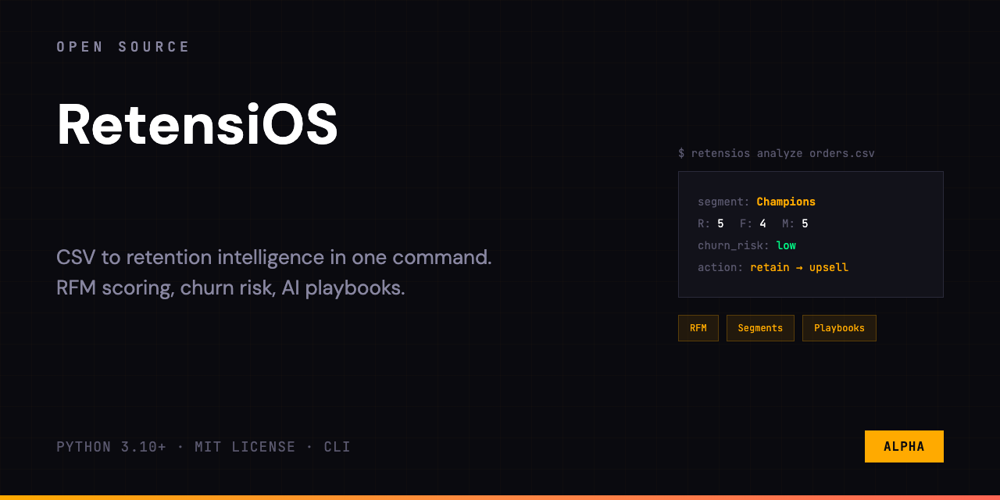
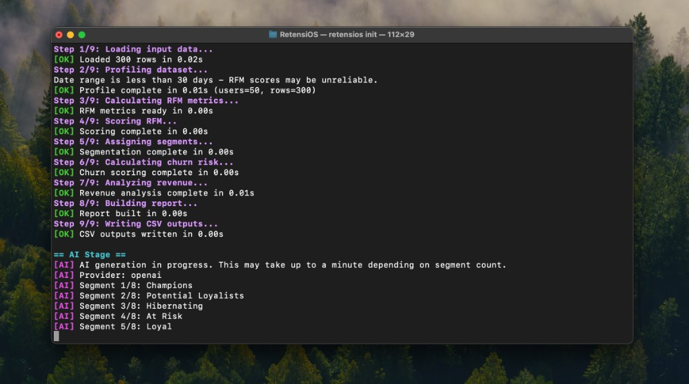
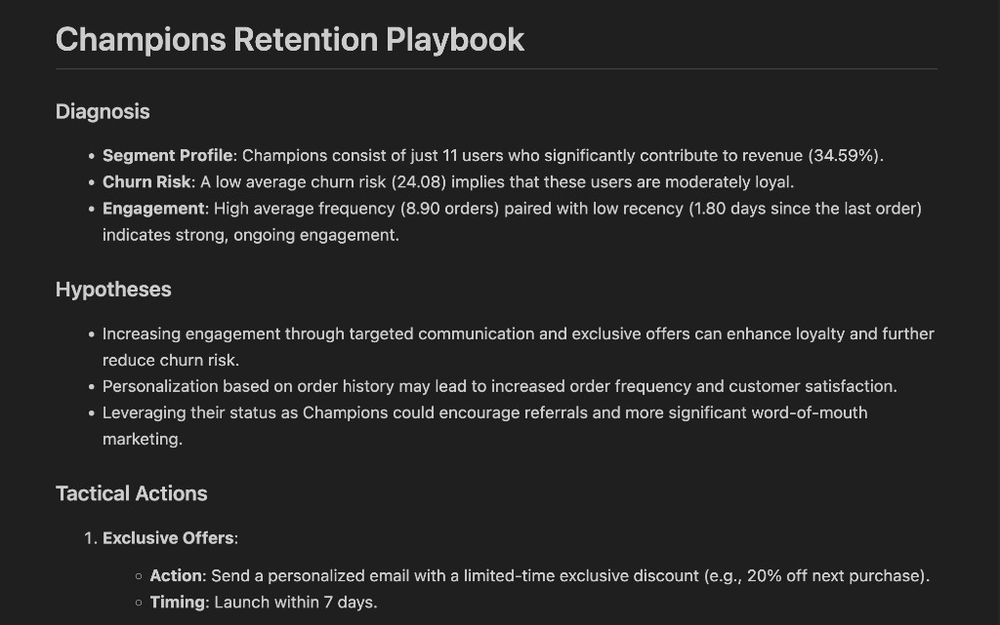
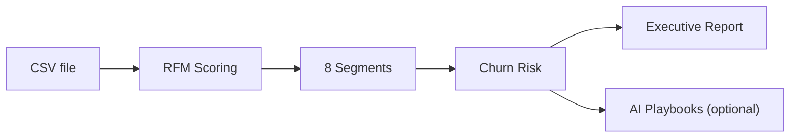

<p align="center">
  
</p>

<p align="center">
  
  
  
</p>

**Know which customers you're losing — and what to do about it.**

One CLI command turns your transaction CSV into customer segments, churn risk scores, revenue exposure analysis, and an executive report. No database, no dashboard, no code to write.



## Who Is This For

- **Product & growth teams** who need retention insights without waiting on an analyst.
- **Solo founders & indie hackers** who don't have a BI stack but have transaction data.
- **Data analysts** who want a fast baseline before diving deeper.
- **Anyone with a CSV** of transactions who wants to understand churn risk today, not next week.

## What You Get

Every run produces four files in seconds — deterministic, repeatable, ready to share:

| File | What's inside |
|------|--------------|
| `customers_rfm_<name>.csv` | Customer-level RFM metrics, scores, segment, and churn risk |
| `segments_summary_<name>.csv` | Segment aggregates: users, revenue, risk, revenue at risk |
| `report_<name>.md` | Executive retention summary with strategic priorities |
| `segment_playbooks_<name>.md` | AI-generated tactical playbooks per segment (optional) |

## Quick Start

```bash
pip install .
retensios init
retensios run data.csv
```

Review the outputs in `outputs/data/`. Here's what the executive report looks like on a 200-customer dataset:

```
Executive Summary
  200 users · $100,844 total revenue
  Largest segment: Potential Loyalists (23.4% share)
  Highest risk: Lost (74.9% avg churn risk)

Revenue at Risk: $34,678

Segment Overview
  Segment              Users   Rev Share   Avg Risk   Rev at Risk
  Potential Loyalists     49     23.4%      30.8%       $7,268
  At Risk                 34     21.7%      38.7%       $8,458
  Champions               24     17.4%      16.8%       $2,935
  Promising               30     13.4%      36.7%       $4,975
  Hibernating             35     12.4%      53.7%       $6,693
  Loyal                   13      8.0%      23.3%       $1,879
  Lost                    11      2.7%      74.9%       $2,048
  New                      4      1.1%      38.6%         $422

Strategic Priority
  Focus on: At Risk, Potential Loyalists, Hibernating
  These segments combine meaningful revenue with elevated churn pressure.
```

## Before vs After

| | Traditional approach | RetensiOS |
|---|---|---|
| **Tools needed** | SQL + Python/R + BI dashboard | One CLI command |
| **Setup time** | Hours to days | `pip install .` |
| **Time to insight** | 1–3 days | ~30 seconds |
| **Repeatability** | Manual, prone to drift | Deterministic — same data, same result |
| **Cost** | Analyst time + tool licenses | Free and open-source |

## AI Playbooks

Plug in an OpenAI or Anthropic API key and each segment gets a tactical playbook with concrete next steps:



```text
At Risk — Tactical Playbook

Segment Size: 34 users.
Revenue Share: 21.69% of total revenue.
Churn Risk: 38.66 (moderate risk).
Recency: 4.60 days since last order.

Tactical Actions:
- Launch a personalized email campaign within 7 days with a 15% incentive.
- Send a short feedback survey within 10 days to identify drop-off drivers.
- Run a re-engagement SMS touchpoint within 14 days with urgency CTA.
```

AI is fully optional — skip it with `--no-ai` or simply don't configure an API key. Core outputs are always generated.

```bash
retensios config set provider "anthropic"
retensios config set api-key "your-api-key"
retensios run data.csv
```

RetensiOS resolves the API key in this order: CLI flag (`--api-key`) > environment variable (`OPENAI_API_KEY` / `ANTHROPIC_API_KEY`) > global config (`~/.config/retensios/config.toml`).

## How It Works



## Input Data

RetensiOS accepts a CSV with these columns:

| Column | Required | Description |
|--------|----------|-------------|
| `user_id` | Yes | Customer identifier |
| `order_date` | Yes | Transaction date (flexible format) |
| `revenue` | Yes | Transaction amount |
| `order_id` | No | Transaction ID (used for frequency if present) |

Negative revenue rows are treated as refunds and dropped by default. Use `--include-refunds` to keep them.

## CLI Reference

```bash
retensios run <input.csv>     # main pipeline
retensios init                # interactive first-run setup
retensios config set <k> <v>  # persist settings
retensios config get <key>    # read a setting
retensios config path         # show config file location
```

`run` options:

| Flag | Description |
|------|-------------|
| `--advanced` | Print extended profiling info |
| `--today YYYY-MM-DD` | Override reference date for recency |
| `--include-refunds` | Keep negative revenue rows |
| `--no-ai` | Skip AI playbook generation |
| `--api-key KEY` | Override API key for this run |
| `--provider [openai\|anthropic]` | Override AI provider for this run |
| `--output PATH` | Output root directory (default: `outputs`) |

<details>
<summary><strong>Pipeline Details</strong></summary>

### 9-Step Pipeline

RetensiOS runs a deterministic pipeline:

1. Load and validate transaction data.
2. Profile dataset quality and shape.
3. Calculate RFM metrics (Recency, Frequency, Monetary).
4. Score users into 1–5 R/F/M buckets via quantile binning.
5. Map users to business segments.
6. Compute churn risk (0–100 proxy).
7. Analyze revenue exposure and concentration.
8. Build an executive Markdown report.
9. Write CSV and report artifacts.

### Business Segments

Users are mapped to one of 8 segments based on their R/F/M scores:

| Segment | Description |
|---------|-------------|
| Champions | Highest value and engagement (R: 4–5, F: 4–5, M: 4–5) |
| Loyal | Frequent, loyal purchasers (R: 3–5, F: 4–5) |
| New | Recent first-time buyers (R: 5, F: 1) |
| Potential Loyalists | High-recency prospects (R: 4–5, F: 1–3) |
| Promising | Emerging customers (R: 3, F: 1–3) |
| At Risk | Historically valuable but silent (R: 1–2, F: 3–5, M: 3–5) |
| Hibernating | Inactive, may return (R: 1–2) |
| Lost | Minimal engagement (R: 1, F: 1, M: 1) |

### Churn Risk

A weighted proxy score from 0 (safe) to 100 (high risk):

- 55% — Recency (longer absence = higher risk)
- 30% — Frequency (fewer orders = higher risk)
- 15% — Monetary (lower spend = higher risk)

</details>

## Installation

```bash
pip install .
```

Development setup:

```bash
python -m venv .venv
source .venv/bin/activate
pip install -e ".[dev]"
```

## FAQ

**What size datasets does it handle?**
RetensiOS uses pandas under the hood. It works well with datasets up to hundreds of thousands of rows on a typical machine. For millions of rows, you may need more memory.

**How accurate is the churn risk score?**
The churn score is a heuristic proxy based on RFM weights, not a predictive ML model. It's designed to rank customers by relative risk and prioritize action — not to predict exact churn probability.

**Can I automate it?**
Yes. The pipeline is fully deterministic — same input always produces the same output. Pipe it into a cron job, CI pipeline, or any scheduler.

**Does it work without an AI API key?**
Absolutely. AI playbooks are optional. Without a key, RetensiOS still generates all core outputs: RFM scores, segments, churn risk, revenue analysis, and the executive report.


See [open issues](https://github.com/alexe-ev/RetensiOS/issues) for more.

## Contributing

```bash
pytest --cov
ruff check .
```

Before opening a PR:

- Add or update tests for behavioral changes.
- Keep docs in sync with implementation.
- Ensure deterministic outputs are preserved for golden tests.

## License

[MIT](LICENSE)
